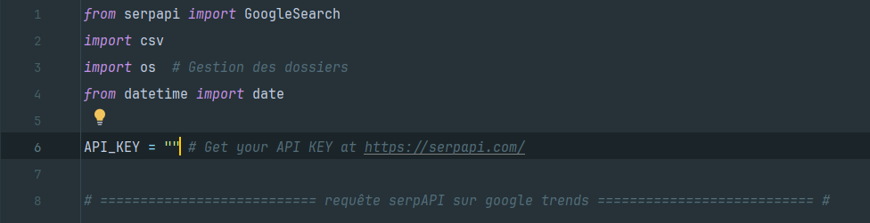

# Get CSV from GG Trends

Développé par Nathan ROI
Contact : nathan.roi@disroot.org

---

Ce script permet d’enregistrer dans un fichier CSV le résultat d’une recherche google trends. Le résultat obtenue est un classement par région en France.
Pour cela j’utilise SerpAPI.
<br/>
### Table des matières
- [Prérequis](#prérequis)
- [Installer le package serpAPI](#installer-le-package-serpapi)
- [Lancer le programme](#Lancer-le-programme)
<br/>
### Prérequis

- python 3.11+ avec pip. Télécharger python → https://www.python.org/downloads/
- Une clé API (SerpAPI). Vous pouvez obtenir une clé ici → https://serpapi.com/

Python et pip doivent être accessible dans votre terminal, pour vérifier cela vous pouvez faire les deux commandes suivantes :

```bash
python --version # Retourne la version de python

pip --version # Retourne la version de pip
```

Si l’une ou ces deux commandes ne renvoient rien, internet et là ou alors envoyer moi un mail.

### Installer le package serpAPI

```bash
pip install google-search-results
```
### Ajouter votre clé API

<small>Compléter la variable ```API_KEY``` avec votr clé API</small>

### Lancer le programme
```bash
python getCSVofGGTrends.py
```